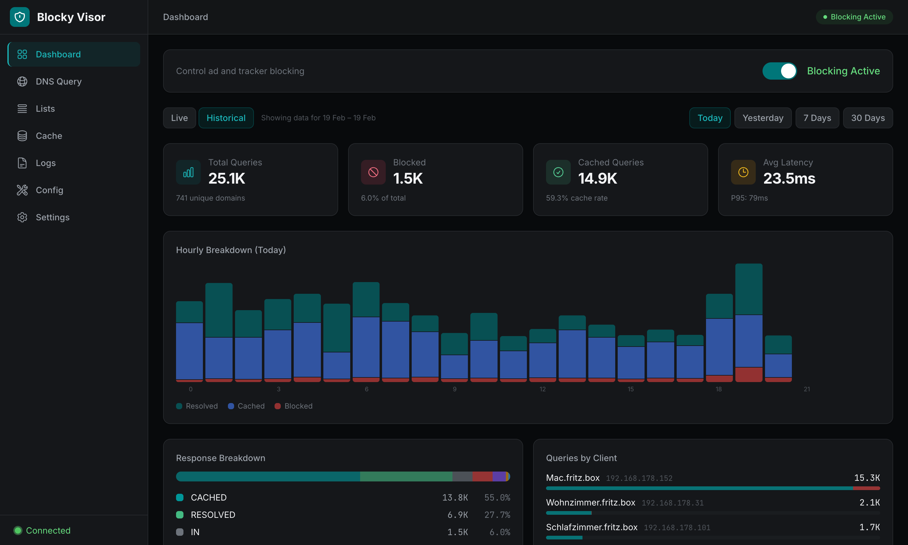

# Blocky Visor

A sleek, self-hosted web dashboard for [Blocky](https://github.com/0xERR0R/blocky) — monitor your DNS blocking, run queries, and manage your instance from any browser.



## About

Blocky Visor is an open-source single-page application that gives you full visibility and control over your [Blocky](https://github.com/0xERR0R/blocky) DNS proxy and ad blocker. It connects directly to Blocky's REST API and Prometheus metrics endpoint, providing real-time stats, interactive DNS lookups, and one-click management — all from a lightweight static site you can host anywhere.

### Features

**Dashboard** — Live overview of your DNS traffic with auto-refreshing stats: total queries, block rate, cache hit rate, average latency, response breakdown by category, and per-client query counts.

**DNS Query Tool** — Run manual DNS lookups (A, AAAA, CNAME, MX, and more) through Blocky and inspect the results. Query history is saved locally for quick re-runs.

**Blocking Control** — Toggle ad/tracker blocking on or off with an optional auto-re-enable timer and per-group control.

**List Management** — View denylist entry counts per group and trigger a list refresh from configured sources.

**Cache Management** — Monitor cache entries, hit/miss rates, and flush the DNS cache when needed.

**Settings** — Configure the Blocky API URL at runtime (no rebuild required), adjust polling intervals, and connect an optional sidecar for advanced features.

### Sidecar (Optional)

Blocky Visor includes an optional Go sidecar service that runs alongside Blocky on the same host. It unlocks three additional pages:

- **Analytics** — Historical query analytics with hourly breakdowns, top queried/blocked domains, per-client stats, and response category charts across configurable date ranges.
- **Query Logs** — Paginated, filterable raw query log viewer.
- **Config Editor** — Read and edit Blocky's `config.yml` with YAML validation, automatic backups, and one-click service restart.

## Installation

### Prerequisites

- A running [Blocky](https://github.com/0xERR0R/blocky) instance (v0.24+) with the REST API enabled on port 4000
- Prometheus metrics endpoint enabled in your Blocky config (for dashboard stats)

### Option 1: Static Files

Blocky Visor is a fully static SPA — just build it and serve the files from any web server.

```bash
# Clone the repository
git clone https://github.com/JCHHeilmann/blocky-visor.git
cd blocky-visor

# Install dependencies (Node.js >= 22)
npm install

# Build static files
npm run build
```

The output in `build/` can be served by any web server (Nginx, Caddy, Apache, etc.). Make sure to configure a fallback to `index.html` for SPA routing.

**Nginx example:**

```nginx
server {
    listen 80;
    server_name blocky-visor.local;
    root /var/www/blocky-visor;
    index index.html;

    location / {
        try_files $uri $uri/ /index.html;
    }
}
```

**Caddy example:**

```
blocky-visor.local {
    root * /var/www/blocky-visor
    try_files {path} /index.html
    file_server
}
```

### Option 2: Dev Server as Preview

```bash
npm run build
npm run preview
```

This starts a local preview server for the production build at `http://localhost:4173`.

### Configuration

Once loaded in the browser, go to **Settings** and enter your Blocky API URL (e.g., `http://192.168.1.100:4000`). The URL is saved in your browser's `localStorage` — no rebuild needed to change it.

### Sidecar Setup (Optional)

To enable Analytics, Logs, and Config pages, deploy the Go sidecar on the same machine as Blocky:

```bash
cd sidecar

# Copy and edit the config
cp config.example.yaml config.yaml
# Edit config.yaml — set your API key and CORS origins

# Build and run
go build -o blocky-visor-sidecar .
./blocky-visor-sidecar
```

**`config.yaml` example:**

```yaml
listen: ":8550"
api_key: "your-secret-api-key"
cors_origins:
  - http://blocky-visor.local
  - http://localhost:5173

blocky:
  dir: /opt/blocky
```

Then in Blocky Visor's **Settings** page, enter the sidecar URL and API key.

## Development

### Prerequisites

- [Node.js](https://nodejs.org/) >= 22
- [Go](https://go.dev/) >= 1.21 (only if working on the sidecar)

### Getting Started

```bash
# Clone the repo
git clone https://github.com/JCHHeilmann/blocky-visor.git
cd blocky-visor

# Install dependencies
npm install

# Start the dev server
npm run dev
```

The dev server runs at `http://localhost:5173` with hot module replacement.

### Commands

| Command | Description |
|---|---|
| `npm run dev` | Start dev server with HMR |
| `npm run build` | Build static files to `build/` |
| `npm run preview` | Preview the production build |
| `npm run check` | Run `svelte-check` for type errors |

### Tech Stack

- **[SvelteKit](https://svelte.dev/)** with `adapter-static` (SPA mode)
- **[Svelte 5](https://svelte.dev/blog/svelte-5-is-alive)** runes (`$state`, `$derived`, `$effect`)
- **[TailwindCSS v4](https://tailwindcss.com/)** via `@tailwindcss/vite`
- **[TypeScript](https://www.typescriptlang.org/)** throughout

### Project Structure

```
src/
├── lib/
│   ├── api/           # Fetch wrapper + endpoint modules
│   ├── stores/        # Svelte 5 rune-based stores
│   ├── components/
│   │   ├── layout/    # AppShell, Sidebar, Header
│   │   ├── ui/        # Reusable primitives (Button, Card, Toggle, Modal, etc.)
│   │   ├── dashboard/ # Dashboard-specific components
│   │   ├── query/     # DNS query form and results
│   │   ├── analytics/ # Charts and log viewer
│   │   └── settings/  # Settings forms
│   ├── utils/         # Prometheus metrics parser, formatters
│   └── types/         # TypeScript interfaces and error classes
├── routes/            # Pages: /, /query, /lists, /cache, /settings,
│                      #         /analytics, /logs, /config
└── app.css            # TailwindCSS v4 theme config
sidecar/               # Optional Go sidecar service
```

### Blocky API Reference

Blocky Visor communicates with Blocky's REST API (no auth, port 4000 by default):

| Endpoint | Method | Description |
|---|---|---|
| `/api/blocking/status` | GET | Blocking status |
| `/api/blocking/enable` | GET | Enable blocking |
| `/api/blocking/disable` | GET | Disable blocking (supports `?duration=` and `?groups=`) |
| `/api/query` | POST | DNS query (`{ query, type }`) |
| `/api/lists/refresh` | POST | Re-download blocking lists |
| `/api/cache/flush` | PUT | Flush DNS cache |
| `/metrics` | GET | Prometheus metrics |
